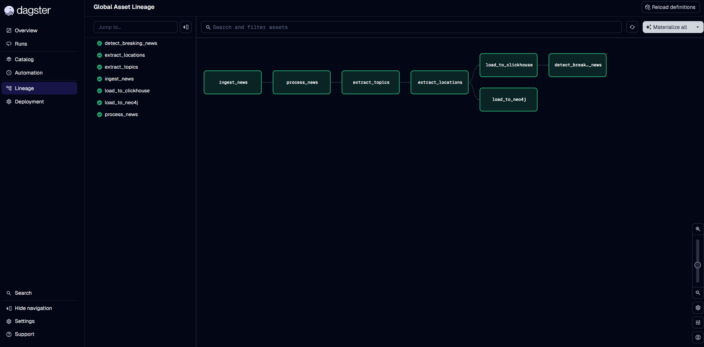
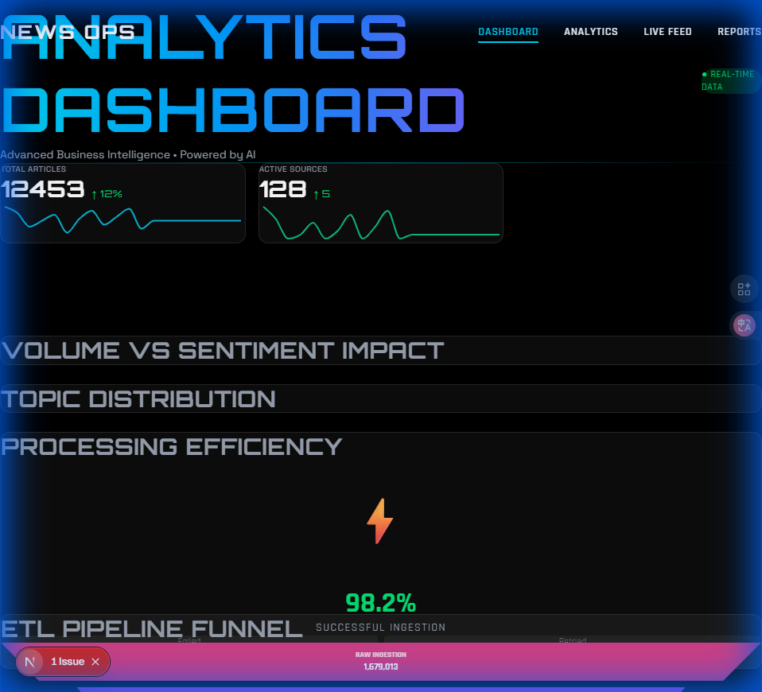
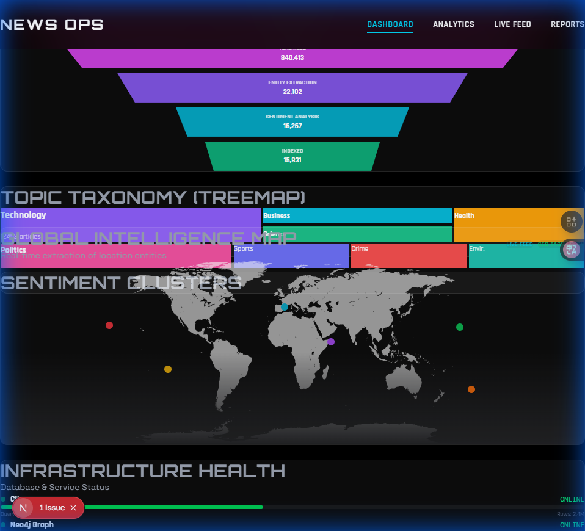
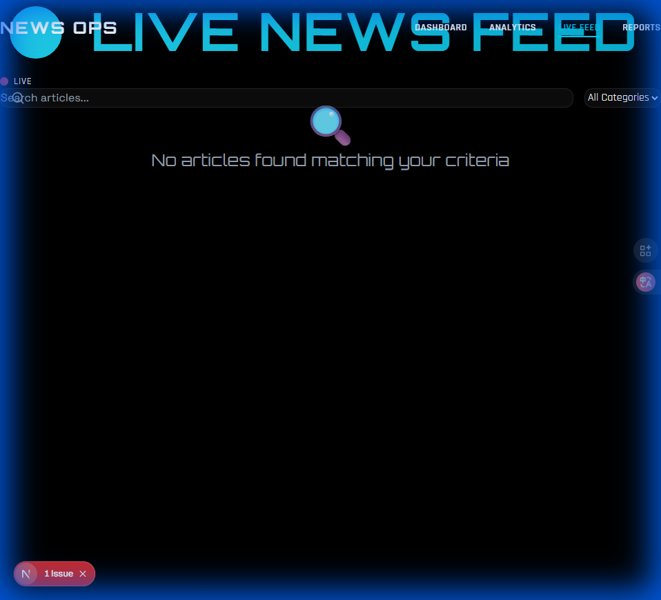

<p align="center">
  
</p>

<h1 align="center">📰 NewsOps — News Intelligence Platform</h1>

<p align="center">
  <b>A Next-Generation News Data Engineering Platform</b><br/>
  Real-time global news monitoring with AI-powered sentiment analysis, topic extraction, and knowledge graph generation.
</p>

<p align="center">
  
  
  
  
  
  
  
</p>

---

##  Overview

**NewsOps** is a production-ready, full-stack data engineering platform that ingests, processes, and analyzes news articles in real-time. It combines cutting-edge technologies to deliver:

- ** Real-time Data Pipelines** — Orchestrated by Dagster with asset-based workflows
- ** AI-Powered Analytics** — Sentiment analysis, topic modeling, and entity extraction
- ** Knowledge Graph** — Neo4j-powered entity relationships and location mapping
- ** Business Intelligence** — Interactive dashboards with advanced visualizations
- ** High-Performance Storage** — ClickHouse OLAP database for lightning-fast queries

---

##  Features

###  Data Ingestion
- Multi-source news aggregation via GNews API
- Configurable category filtering (Technology, Business, Sports, Health, Politics)
- Real-time streaming with Apache Kafka
- Automatic deduplication and data validation

###  AI/ML Processing
- **Sentiment Analysis** — TextBlob-powered polarity scoring
- **Topic Extraction** — Keyword-based topic classification with BERTopic integration
- **Named Entity Recognition** — spaCy NER for location, organization, and person extraction
- **Geocoding** — Automatic coordinate extraction for geospatial analytics

###  Data Storage
- **ClickHouse** — Columnar OLAP database for fast analytical queries
- **Neo4j** — Graph database for entity relationships and knowledge graphs
- **PostgreSQL** — Metadata and orchestration state management

###  Visualization
- **Streamlit Dashboard** — Real-time analytics with interactive charts
- **Next.js Web App** — Modern, responsive UI with glassmorphism design
- **Global Intelligence Map** — Geospatial visualization of news hotspots

---

##  Screenshots

###  Homepage
<p align="center">
  
</p>

###  Analytics Dashboard
<p align="center">
  
</p>

<p align="center">
  
</p>

###  Live News Feed
<p align="center">
  
</p>

###  Dagster Pipeline
<p align="center">
  
</p>

---

##  Architecture

```
┌─────────────────────────────────────────────────────────────────────────────┐
│                            NewsOps Architecture                              │
├─────────────────────────────────────────────────────────────────────────────┤
│                                                                              │
│  ┌──────────────┐     ┌──────────────┐     ┌──────────────┐                 │
│  │  GNews API   │────▶│    Kafka     │────▶│   Dagster    │                 │
│  │  (Sources)   │     │  (Streaming) │     │ (Orchestration)                │
│  └──────────────┘     └──────────────┘     └──────┬───────┘                 │
│                                                    │                         │
│                    ┌───────────────────────────────┼───────────────────────┐ │
│                    │           Data Processing Pipeline                    │ │
│                    │  ┌─────────┐ ┌─────────┐ ┌─────────┐ ┌─────────┐     │ │
│                    │  │ Ingest  │▶│ Process │▶│ Extract │▶│  Load   │     │ │
│                    │  │  News   │ │Sentiment│ │ Topics  │ │  Data   │     │ │
│                    │  └─────────┘ └─────────┘ └─────────┘ └────┬────┘     │ │
│                    └───────────────────────────────────────────┼───────────┘ │
│                                                                │             │
│         ┌──────────────────────────┬───────────────────────────┘             │
│         ▼                          ▼                                         │
│  ┌──────────────┐           ┌──────────────┐                                 │
│  │  ClickHouse  │           │    Neo4j     │                                 │
│  │    (OLAP)    │           │   (Graph)    │                                 │
│  └──────┬───────┘           └──────┬───────┘                                 │
│         │                          │                                         │
│         └──────────┬───────────────┘                                         │
│                    ▼                                                         │
│         ┌──────────────────────────┐                                         │
│         │    Visualization Layer    │                                        │
│         │  ┌────────┐ ┌──────────┐ │                                        │
│         │  │Streamlit│ │ Next.js  │ │                                        │
│         │  │Dashboard│ │ Web App  │ │                                        │
│         │  └────────┘ └──────────┘ │                                        │
│         └──────────────────────────┘                                         │
│                                                                              │
└─────────────────────────────────────────────────────────────────────────────┘
```

### Technology Stack

| Component | Technology | Description |
|-----------|------------|-------------|
| **Orchestration** | Dagster | Asset-based pipeline orchestration with lineage tracking |
| **Streaming** | Apache Kafka | Real-time event streaming and message queuing |
| **Storage (OLAP)** | ClickHouse | High-performance columnar database for analytics |
| **Storage (Graph)** | Neo4j | Knowledge graph for entity relationships |
| **NLP** | spaCy, TextBlob | Sentiment analysis and named entity recognition |
| **Topic Modeling** | BERTopic | AI-powered topic extraction |
| **Dashboard** | Streamlit | Interactive Python-based analytics dashboard |
| **Web App** | Next.js 16 | Modern React-based frontend with TypeScript |
| **Styling** | TailwindCSS | Utility-first CSS with glassmorphism effects |
| **Containerization** | Docker Compose | Multi-container orchestration |

---

##  Project Structure

```
newsops/
├──  README.md                      # This file
├──  docker-compose.yml             # Full infrastructure definition
├──  dagster_pepline.png            # Pipeline visualization
├──  screenshots/                   # Application screenshots
│   ├── homepage.png
│   ├── dashboard_top.png
│   ├── dashboard_bottom.png
│   └── live_feed.png
│
└── News_data_engineering_project/
    │
    ├──  etl/                       # Dagster ETL Pipeline
    │   ├── news_pipeline/
    │   │   ├── __init__.py           # Dagster definitions
    │   │   ├── assets.py             # Data assets (ingest, process, load)
    │   │   ├── jobs.py               # Pipeline jobs
    │   │   └── schedules.py          # Automated scheduling
    │   ├── Dockerfile
    │   └── workspace.yaml
    │
    ├──  dashboard/                 # Streamlit Dashboard
    │   ├── app.py                    # Main dashboard application
    │   ├── pages/                    # Multi-page dashboard
    │   │   ├── 01_All_Articles.py
    │   │   ├── 02_Breaking_News.py
    │   │   ├── 03_Daily_Digest.py
    │   │   ├── 04_Topic_Extraction.py
    │   │   ├── 05_NER_Locations.py
    │   │   ├── 06_Ingestion_Monitor.py
    │   │   ├── 09_Neo4j_Explorer.py
    │   │   ├── ai_insights.py
    │   │   ├── sentiment_trends.py
    │   │   └── system_metrics.py
    │   ├── Dockerfile
    │   └── requirements.txt
    │
    ├──  web_app/                   # Next.js Web Application
    │   ├── client/
    │   │   ├── app/
    │   │   │   ├── page.tsx          # Homepage
    │   │   │   ├── dashboard/        # Analytics dashboard
    │   │   │   ├── feed/             # Live news feed
    │   │   │   ├── analytics/        # Analytics page
    │   │   │   └── reports/          # Reports page
    │   │   ├── components/           # Reusable UI components
    │   │   └── public/               # Static assets
    │   ├── server.js                 # API server
    │   └── Dockerfile
    │
    ├──  shared_config/             # Shared configuration
    │   └── settings.json
    │
    └──  docker-compose.yml         # Service definitions
```

---

##  Getting Started

### Prerequisites

- **Docker Desktop** — [Install Docker](https://www.docker.com/products/docker-desktop)
- **Node.js 18+** — [Install Node.js](https://nodejs.org/)
- **Python 3.9+** — [Install Python](https://www.python.org/)

###  Quick Start with Docker

1. **Clone the repository**
   ```bash
   git clone https://github.com/yourusername/newsops.git
   cd newsops/News_data_engineering_project
   ```

2. **Start all services**
   ```bash
   docker-compose up -d
   ```

3. **Access the interfaces**

   | Service | URL | Description |
   |---------|-----|-------------|
   | **Dagster UI** | [http://localhost:3000](http://localhost:3000) | Pipeline orchestration |
   | **Streamlit** | [http://localhost:8501](http://localhost:8501) | Analytics dashboard |
   | **Next.js App** | [http://localhost:3001](http://localhost:3001) | Modern web interface |
   | **Neo4j Browser** | [http://localhost:7474](http://localhost:7474) | Graph database explorer |
   | **ClickHouse** | [http://localhost:8123](http://localhost:8123) | OLAP query interface |

###  Development Setup

#### Running the Next.js Web App Locally

```bash
cd News_data_engineering_project/web_app/client
npm install
npm run dev
```

The app will be available at [http://localhost:5174](http://localhost:5174).

#### Running the Streamlit Dashboard Locally

```bash
cd News_data_engineering_project/dashboard
pip install -r requirements.txt
streamlit run app.py
```

---

##  Configuration

### Environment Variables

Create a `.env` file in the project root:

```env
# ClickHouse
CLICKHOUSE_HOST=http://localhost:8123

# Neo4j
NEO4J_URI=bolt://localhost:7687
NEO4J_USER=neo4j
NEO4J_PASSWORD=password

# Dagster
DAGSTER_POSTGRES_USER=postgres_user
DAGSTER_POSTGRES_PASSWORD=postgres_password
DAGSTER_POSTGRES_DB=postgres_db
```

### Pipeline Settings

Edit `shared_config/settings.json`:

```json
{
  "max_articles": 20,
  "active_categories": ["Technology", "Business", "Sports", "Health", "Politics"]
}
```

---

##  Data Pipeline

### Asset Lineage

The Dagster pipeline consists of the following assets:

```
ingest_news → process_news → extract_topics → extract_locations
                    │                              │
                    ▼                              ▼
            detect_breaking_news          load_to_clickhouse
                                                   │
                                                   ▼
                                            load_to_neo4j
```

### Pipeline Assets

| Asset | Description | Output |
|-------|-------------|--------|
| `ingest_news` | Fetches news from GNews API across configured categories | Raw article DataFrame |
| `process_news` | Analyzes sentiment using TextBlob | DataFrame with sentiment scores |
| `extract_topics` | Classifies articles into topics using keyword matching | DataFrame with topic labels |
| `extract_locations` | Extracts locations using spaCy NER and geocodes them | DataFrame with coordinates |
| `detect_breaking_news` | Identifies breaking news based on keywords and sentiment | Flagged breaking articles |
| `load_to_clickhouse` | Loads processed data into ClickHouse OLAP | ClickHouse table |
| `load_to_neo4j` | Creates knowledge graph in Neo4j | Graph nodes and relationships |

---

##  Dashboard Features

### Main Dashboard
- **KPI Cards** — Total articles, active sources, average sentiment
- **Volume vs Sentiment Impact** — Bar chart comparing article volume and sentiment by category
- **Topic Distribution** — Pie chart showing topic breakdown
- **ETL Pipeline Funnel** — Visual representation of data flow
- **Global Intelligence Map** — Geospatial visualization with location hotspots
- **Infrastructure Health** — Real-time status of ClickHouse and Neo4j

### Pages
- ** All Articles** — Browse and search all ingested articles
- ** Breaking News** — Real-time breaking news alerts
- ** Daily Digest** — Summarized daily news overview
- ** Topic Extraction** — Explore topic clusters
- ** NER Locations** — Geographic entity analysis
- ** Sentiment Trends** — Historical sentiment analysis
- ** Neo4j Explorer** — Interactive knowledge graph exploration
- ** System Metrics** — Infrastructure monitoring

---

## Database Schemas

### ClickHouse Table: `news_articles`

```sql
CREATE TABLE news_articles (
    title String,
    description String,
    content String,
    published_at DateTime,
    url String,
    publisher String,
    category String,
    sentiment Float32,
    processed_at DateTime,
    topic_id Int32,
    topic_label String,
    locations Array(String),
    coordinates Array(Tuple(Float64, Float64))
) ENGINE = MergeTree()
ORDER BY published_at
```

### Neo4j Graph Model

```
(:Publisher)-[:PUBLISHED]->(:Article)-[:BELONGS_TO]->(:Topic)
                              |
                              └-[:MENTIONS]->(:Location)
```

---

##  Security

- **Database Credentials** — Managed via environment variables
- **Neo4j Authentication** — Default: `neo4j/password` (change in production!)
- **API Keys** — Store in environment variables, never commit to source control

---

##  Contributing

1. Fork the repository
2. Create a feature branch (`git checkout -b feature/amazing-feature`)
3. Commit your changes (`git commit -m 'Add amazing feature'`)
4. Push to the branch (`git push origin feature/amazing-feature`)
5. Open a Pull Request

---

##  License

This project is licensed under the MIT License — see the [LICENSE](LICENSE) file for details.

---

##  Acknowledgments

- [Dagster](https://dagster.io/) — Modern data orchestration
- [ClickHouse](https://clickhouse.com/) — Lightning-fast OLAP
- [Neo4j](https://neo4j.com/) — Graph database technology
- [Apache Kafka](https://kafka.apache.org/) — Distributed streaming
- [Streamlit](https://streamlit.io/) — Data app framework
- [Next.js](https://nextjs.org/) — React framework
- [spaCy](https://spacy.io/) — Industrial-strength NLP
- [GNews](https://gnews.io/) — News API

---

<p align="center">
  Made with ❤️ by Achraf ER-RAHOUTI
</p>

<p align="center">
  <a href="#-newsops--news-intelligence-platform">Back to Top </a>
</p>
